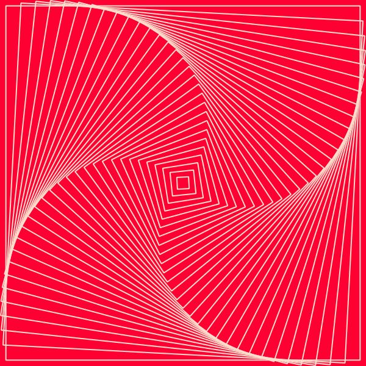

# node-pts-canvas: Using Pts library with node-canvas



**[experimental]** This implementation let you use the Pts library (https://ptsjs.org) in [node-canvas](https://github.com/Automattic/node-canvas). With node-canvas, you can render graphics without using the browser, and you can save super high-resolution images and svg.

Currently, only basic features of Pts are implemented. Please file an issue or submit a PR if you need additional features.

### How it works

Take a look at `index.js` for an example. 

Typically, you'll create either a `NodeCanvasSpace` or `NodeSVGSpace`, and apply the Pts code as is. (Note: you'll use canvas code for svg generation in this case, since we're using node-canvas to render svg)

And instead of creating an interactive animation via `space.play()`, we will use `toPNG()`, `toJPG()`, or `toSVG()` functions to generate a static image.

That's it! Let's run it:

```bash
node index.js
```

### License
Apache License 2.0. See LICENSE file for details.   
Copyright © 2021 by William Ngan and contributors.
